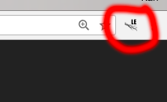
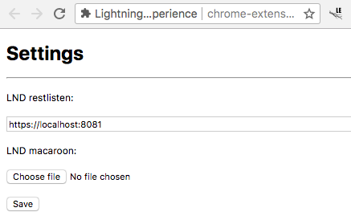
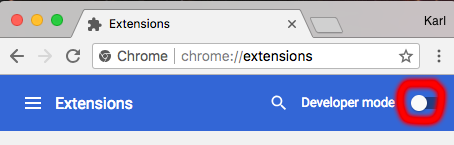
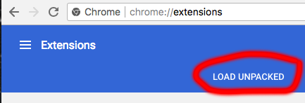

# Lightning Experience
Lightning Experience is a Chrome extension that connects to your LND client through REST API. It will scan the web pages you visit for Lightning Network invoices and show a convenient widget to pay it. This is a proof of concept and should not be used in production unless you're willing to lose money.

## Usage

### Configure
Open settings by clicking the Lightning Experience icon in the top right.

Enter your restlisten and macaroon.

## Requirements
* [yarnpkg.com/en/](https://yarnpkg.com/en/)
* [nodejs.org/en/](https://nodejs.org/en/) (>=6.13.1)

## Build from source
Run the clean build script:
`./clean_build.sh`

This will create an unpacked extension into the `extension` directory.

To load the extension go to:
`chrome://extensions`

Make sure developer mode is enabled.

Click `LOAD UNPACKED` and select your extension directory.

## Contributing
Pull requests welcome :=).
